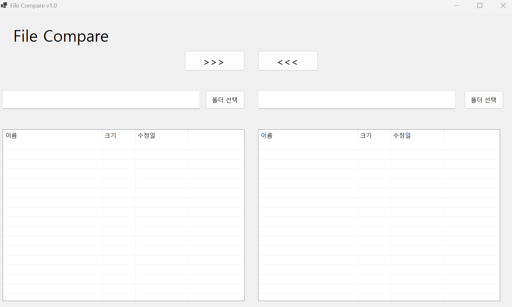
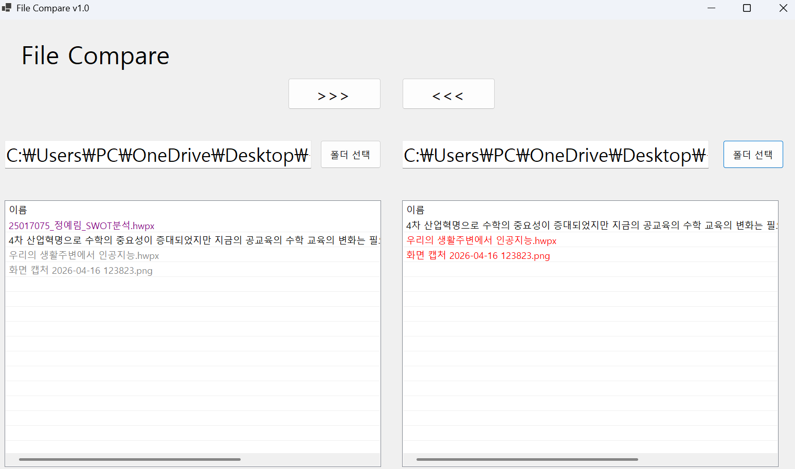

# (C# 코딩) 파일 비교 xnf (File Compare Tool)

## 개요

- 1줄 소개: 파일 목록에서 파일을 관리하는 기능을 구현했습니다.

- 사용한 플랫폼:
 - C#, .NET Windows Forms, Visual Stdio, GitHub
- 사용한 컨트롤:
 - SplitContainer, Panel, ListView
 - 사용한 기술과 구현한 기능:
 - 파일 비교 및 상태 표시
 - 선택 파일 복사
 - 파일 비교 결과를 색상으로 표시
 - 선택 강조

## 실행 화면 (과제1)
- 과제1 코드의 실행 스크린샷

- 과제 내용
 - UI 구성
 - GUI 설계
 - 컨트롤 배치
 - 컨트롤의 기본 기능 확인과 구현
 - 컨트롤에서 기본적으로 제공하는 기능 구동 확인
 - 다시 주문할 수 있도록 초기화

- 구현 내용과 기능 설명
 - 버튼 과 라벨과 ListView를 적절히 배치함
 - 배치한 UI에 맞게 기능을 추가함
 - SplitContainer과 판넬로 영역을 구분했음

## 실행 화면 (과제2)
- 과제 2 코드의 실행 스크린샷

- 과제 내용

- 구현 내용과 기능 설명

 ## 실행 화면 (과제3)
- 과제 3 코드의 실행 스크린샷

- 과제 내용

- 구현 내용과 기능 설명

 ## 실행 화면 (과제4)
- 과제 4 코드의 실행 스크린샷

- 과제 내용

- 구현 내용과 기능 설명

